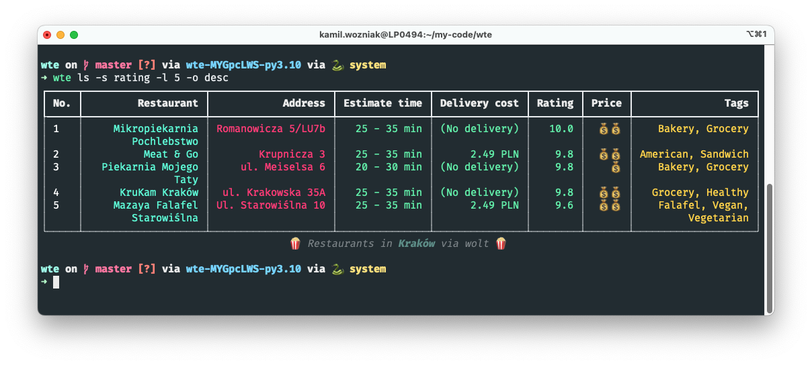

<h2>🍔 What to eat? 🍕</h2>


<p align="center">
    <em>CLI tool to query Wolt API in your location!</em>
</p>

---
Why to use *what-to-eat*? How many times have you not known what to order for dinner or lunch? *What-to-eat* will help you querying and filtering restaurants available in your location via [Wolt](https://wolt.com/pl/discovery) app! 🍔

Example usage:

<p align="center">
    
</p>

<h3>🛠️ Installation</h3>

```console
work in progress
```

<h3>💬 Available commands</h3>

There are currently 3 commands available, one of which is used to configure the tool: `configure`, `ls`, `random`:

```console
$ what-to-eat --help

 Usage: what-to-eat [OPTIONS] COMMAND [ARGS]...

╭─ Options ────────────────────────────────────────────────────────────────────╮
│ --install-completion          Install completion for the current shell.      │
│ --show-completion             Show completion for the current shell, to copy │
│                               it or customize the installation.              │
│ --help                        Show this message and exit.                    │
╰──────────────────────────────────────────────────────────────────────────────╯
╭─ Commands ───────────────────────────────────────────────────────────────────╮
│ configure       Create configuration file to your orders                     │
│ ls              Finds best restaurants via Wolt API                          │
│ random          Finds random restaurant via Wolt API                         │
╰──────────────────────────────────────────────────────────────────────────────╯

```

You can find examples of using these commands in the section below.


<h3>✨ Examples</h3>
Configure your tool:

```console
$ what-to-eat configure
```


List all available restaurants in your localization:

```console
$ what-to-eat ls
```


Sort restaurants by `rating` and limit results to 5 records:
```console
$ what-to-eat ls --sort rating --ordering desc --limit 5
┏━━━━━┳━━━━━━━━━━━━━━━━━━━━━━━━━━━━━━━━━━━━━━━━━━┳━━━━━━━━━━━━━━━━━━━━━━━━━━┳━━━━━━━━━━━━━━━┳━━━━━━━━━━━━━━━┳━━━━━━━━┳━━━━━━━┳━━━━━━━━━━━━━━━━━━━━━┓
┃ No. ┃                               Restaurant ┃                  Address ┃ Estimate time ┃ Delivery cost ┃ Rating ┃ Price ┃                Tags ┃
┡━━━━━╇━━━━━━━━━━━━━━━━━━━━━━━━━━━━━━━━━━━━━━━━━━╇━━━━━━━━━━━━━━━━━━━━━━━━━━╇━━━━━━━━━━━━━━━╇━━━━━━━━━━━━━━━╇━━━━━━━━╇━━━━━━━╇━━━━━━━━━━━━━━━━━━━━━┩
│ 1   │               Mikropiekarnia Pochlebstwo │       Romanowicza 5/LU7b │   25 - 35 min │ (No delivery) │   10.0 │  💰💰 │     Bakery, Grocery │
│ 2   │                            KruKam Kraków │        ul. Krakowska 35A │   30 - 40 min │ (No delivery) │    9.8 │  💰💰 │    Grocery, Healthy │
│ 3   │                    Piekarnia Mojego Taty │           ul. Meiselsa 6 │   20 - 30 min │ (No delivery) │    9.8 │    💰 │     Bakery, Grocery │
│ 4   │  MARLIN - Fish & Chips - Smażalnie Rybne │ Krowoderskich Zuchów 21A │   45 - 55 min │ (No delivery) │    9.6 │  💰💰 │ Fish, Mediterranean │
│ 5   │ Lody Ice Cream NOW - Stare Miasto II (K) │  This is a virtual venue │   20 - 30 min │ (No delivery) │    9.6 │  💰💰 │           Ice cream │
└─────┴──────────────────────────────────────────┴──────────────────────────┴───────────────┴───────────────┴────────┴───────┴─────────────────────┘
                                                        🍿 Restaurants in Kraków via wolt 🍿
```


By default your first profile is `default` one. But while listing restaurants you can change it using `profile` option:

```console
$ what-to-eat ls --profile work
```

You can also display restaurant details:

```console
$ what-to-eat ls 'KruKam Kraków'
┏━━━━━━━━━━━━━━━━━━┳━━━━━━━━━━━━━━━━━━━━━━━━━━━━━━━━━━━━━━━━━━━━━━━━━━━━┓
┃ 🍕 KruKam Kraków ┃                       Kraków, ul. Krakowska 35A 🍕 ┃
┡━━━━━━━━━━━━━━━━━━╇━━━━━━━━━━━━━━━━━━━━━━━━━━━━━━━━━━━━━━━━━━━━━━━━━━━━┩
│           Rating │                           Amazing (9 / 10 reviews) │
│            Price │                                               💰💰 │
│          Website │ https://wolt.com/pl/pol/krakow/venue/krukam-krakow │
│            Phone │                                      +48 533442291 │
│  Payment Methods │                                               Card │
│             Tags │                 Grocery, Healthy, Sweet, Specialty │
└──────────────────┴────────────────────────────────────────────────────┘
```

However, perhaps the coolest options is to randomly select restaurants.
```console
$ what-to-eat random
```

**Note:** The selection algorithm is based on the ranking and delivery time for a given restaurant.

You can also enter a tag based on which a restaurant will be randomly selected:

```console
$ what-to-eat random --tag pizza
```


<h3>📚 License</h3>

This project is licensed under the terms of the MIT license.
